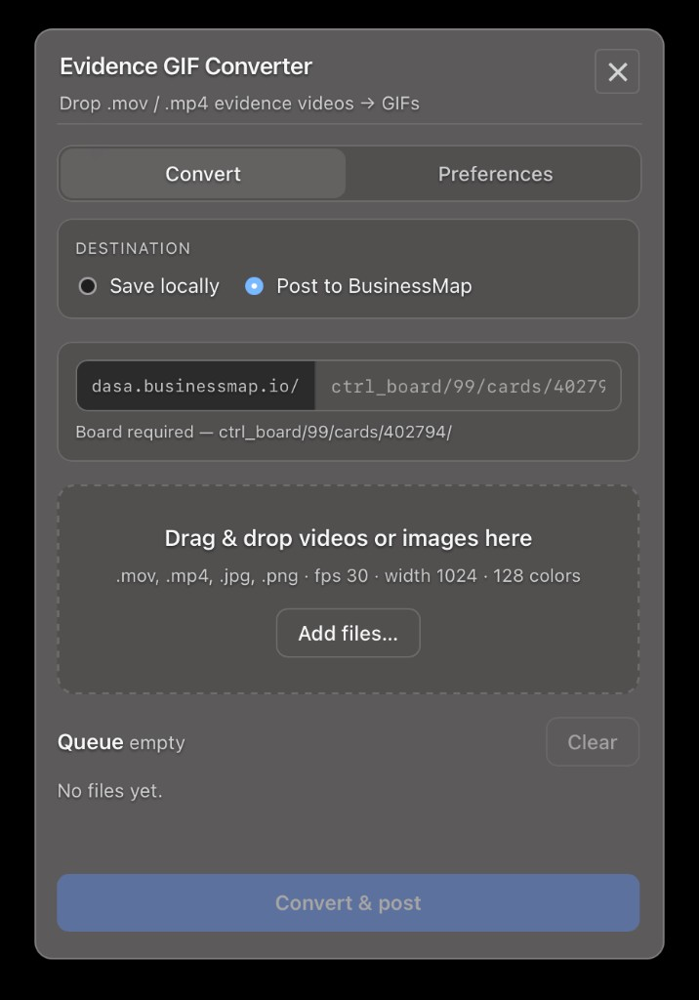

# Evidence GIF Converter

A lightweight menu bar / system tray app for turning screen recordings and evidence videos into optimized GIFs — then posting them to a [BusinessMap](https://businessmap.io) card or saving them locally for use elsewhere (e.g. Azure PRs).

Built with [Tauri](https://tauri.app/), React, and TypeScript. FFmpeg is bundled in release builds, so teammates can install and run without extra setup.



## Why I built this

I built this tool to make it easier to attach evidence to **BusinessMap** cards and **Azure DevOps pull requests**. A recurring part of my workflow was capturing many screenshots and screen recordings — and whenever a video was `.mov` or `.mp4`, I still had to convert it to GIF so it would render inline in BusinessMap comments instead of forcing people to download and open a file.

On macOS the app lives in the **menu bar**. Drop your files, and it converts and posts to BusinessMap in one step. You can also **save locally** when you only need the GIF for another purpose (for example, pasting into an Azure PR description).

> Uma ferramenta que desenvolvi para facilitar o envio de evidências nos cards do Business Map e também em PRs da Azure.
> Era uma dor recorrente minha ter que gerar várias imagens e vídeos de evidência e, quando os vídeos estavam em .mov ou .mp4, ainda precisar convertê-los para GIF para que ficassem fáceis de visualizar nos comentários do Business Map.
> No macOS, a ferramenta roda na barra de menus (system tray). Basta arrastar e soltar os arquivos que ela faz a conversão automaticamente e publica diretamente no Business Map. Também é possível salvar os arquivos localmente, caso a conversão seja para outro uso.

## What it does

Evidence GIF Converter is a productivity tool for QA, support, and engineering workflows where you capture `.mov` or `.mp4` screen recordings and need a small, shareable GIF quickly.

**Convert tab**

- **Save locally** — batch-convert videos to GIF in a folder you choose (handy for Azure PR descriptions and other tools).
- **Post to BusinessMap** — convert videos (or upload `.jpg` / `.png` images as-is) and attach them as comments on a specific card.
- Drag and drop files, or use **Add files…** to build a queue.
- Watch per-file progress while FFmpeg runs; clear or remove items before converting.

**Preferences tab**

- Tune GIF output: **FPS** (1–30), **width** (height scales automatically), and **palette size** (2–256 colors).
- Configure BusinessMap: base URL, API key (from *My Account → API*), and a comment template (`{filename}` placeholder supported).
- **Test connection** verifies your API key before you post.

## How to use

1. **Launch the app** — it lives in the menu bar (macOS) or system tray (Windows). Click the icon to open the panel; right-click (or Ctrl+click on macOS) for **Quit**.
2. **Choose a destination**
   - *Save locally*: pick an output folder, then add `.mov` / `.mp4` files.
   - *Post to BusinessMap*: enter the card path, e.g. `ctrl_board/99/cards/402794/` (full board path required). Paste a full BusinessMap URL if you prefer — the app normalizes it.
3. **Add files** via drag-and-drop or **Add files…**.
4. Click **Convert** (or **Convert & post** / **Post** when targeting BusinessMap).
5. After a successful BusinessMap upload, use **Open card comments in browser** to jump to the card.

Default GIF settings are 10 fps, 480 px width, and 128 colors. Adjust them in **Preferences** to match your evidence quality vs. file size needs.

## Supported formats

| Destination | Input formats |
|-------------|---------------|
| Save locally | `.mov`, `.mp4` |
| Post to BusinessMap | `.mov`, `.mp4`, `.jpg`, `.jpeg`, `.png` |

Videos are converted to GIF. Images are uploaded directly without conversion.

## Install (teammates)

Download the latest installers from **[GitHub Releases](../../releases)** — same pattern as projects like [Reactotron](https://github.com/infinitered/reactotron/releases). Pick the asset for your platform under **Assets**. No Homebrew, ffmpeg, or PATH setup required.

| Platform | Asset | Install |
|----------|-------|---------|
| **macOS** (Apple Silicon) | `evidence-cvt_*_aarch64.dmg` | Open the DMG, drag the app to Applications |
| **Windows** | `evidence-cvt_*_x64-setup.exe` | Run the NSIS installer |

The app runs from the menu bar / tray and does not appear in the Dock on macOS.

### Publish a new release (maintainers)

1. Bump the version (updates `package.json`, `src-tauri/tauri.conf.json`, and `src-tauri/Cargo.toml`):

```bash
bun run bump          # patch: 0.1.0 -> 0.1.1
bun run bump minor    # 0.1.0 -> 0.2.0
bun run bump 1.0.0    # set exact version
```

2. Commit, tag, and push (the bump script prints the exact commands).

3. GitHub Actions builds macOS and Windows installers and attaches them to the release (workflow: `.github/workflows/release.yml`).

You can also trigger a build manually from the **Actions** tab → **Release** → **Run workflow**.

## Development

Requires [Bun](https://bun.sh/) and Rust (for Tauri).

```bash
bun install
bun tauri dev
```

In dev mode, the app uses bundled FFmpeg sidecars when present; otherwise it falls back to `ffmpeg` / `ffprobe` on your `PATH`.

Fetch sidecars only:

```bash
bun run download-ffmpeg:mac
bun run download-ffmpeg:windows
bun run download-ffmpeg:all
```

Sidecar binaries live in `src-tauri/binaries/` and are not committed to git.

## Release builds (maintainers)

### macOS `.dmg`

```bash
bun install
bun run tauri:build:mac
```

Output: `src-tauri/target/release/bundle/dmg/evidence-cvt_0.1.0_aarch64.dmg`

### Windows `.exe` from macOS (cross-compile)

MSI installers require a Windows machine (WiX). From macOS you can build the NSIS `.exe` installer instead.

One-time setup:

```bash
brew install nsis llvm
rustup target add x86_64-pc-windows-msvc
cargo install --locked cargo-xwin
```

Build:

```bash
bun run tauri:build:windows
```

Output: `src-tauri/target/x86_64-pc-windows-msvc/release/bundle/nsis/evidence-cvt_*_x64-setup.exe`

Build both platforms:

```bash
bun run tauri:build:all
```

Ready-to-share copies are also written to `dist/releases/` when you run the build commands above.

## Tech stack

- **UI**: React 19, TypeScript, Vite
- **Shell**: Tauri 2 (Rust)
- **Video**: FFmpeg / FFprobe (bundled via sidecars in release builds)
- **Integrations**: BusinessMap REST API (file upload + card comments)
- **Persistence**: Tauri Store plugin (output folder, FFmpeg settings, API key)

## Third-party licenses

This app bundles [FFmpeg](https://ffmpeg.org/) via [@ffmpeg-installer](https://www.npmjs.com/package/@ffmpeg-installer/ffmpeg) and [@ffprobe-installer](https://www.npmjs.com/package/@ffprobe-installer/ffprobe) for video conversion. FFmpeg is licensed under the GPL/LGPL depending on build; source is available from the FFmpeg project.
